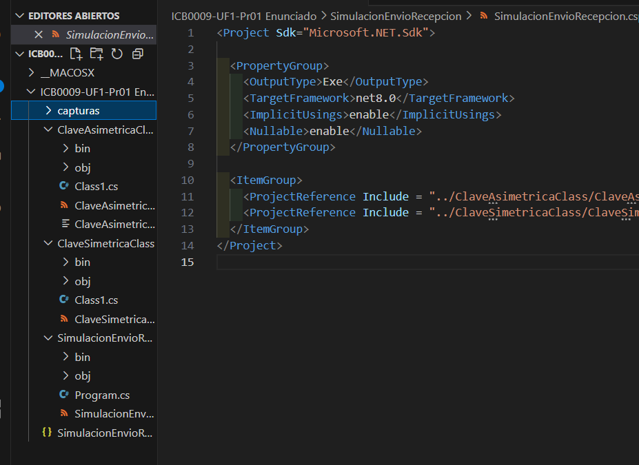
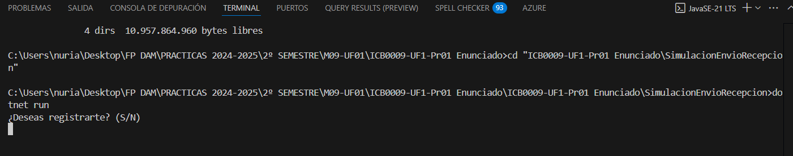
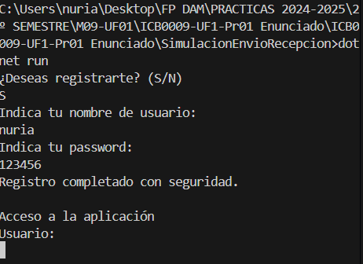
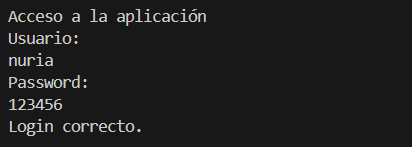

# 🛡️ Simulador de Envío y Recepción Segura de Mensajes
Práctica del módulo M09-UF1 — Simulación de un sistema de envío y recepción de mensajes cifrados y firmados entre emisor y receptor. Se utiliza criptografía **simétrica** (AES) y **asimétrica** (RSA) junto con funciones de **hash SHA-256** para proteger el mensaje.

---

## 🧠 Objetivos

- Implementar una simulación segura de registro, login y transmisión de datos.
- Usar hashing SHA-256 para proteger contraseñas.
- Aplicar cifrado simétrico para el mensaje.
- Aplicar cifrado asimétrico para la clave.
- Validar la integridad mediante firma digital.

---

## 📦 Estructura del Proyecto

```
ICB0009-UF1-Pr01 Enunciado/
│
├── capturas/
│   ├── CS00_apertura_proyecto.png
│   ├── CS01_registro_usuario_1.png
│   ├── CS01_registro_usuario_2.png
│   └── CS02_login_correcto.png
│
├── ClaveAsimetricaClass/
├── ClaveSimetricaClass/
└── SimulacionEnvioRecepcion/
```

---

## 🔐 Tecnologías utilizadas

- Lenguaje: `C#`
- Plataforma: `.NET 6 / 8`
- Hashing: `SHA256`
- Cifrado simétrico: `AES`
- Cifrado asimétrico: `RSA`
- IDE: `Visual Studio Code`

---

## 🧪 Ejecución del Proyecto

Desde terminal, estando en la raíz del proyecto, ejecutar:

```bash
dotnet run --project SimulacionEnvioRecepcion/SimulacionEnvioRecepcion.csproj
```

---

## 📸 Capturas de pantalla

| Fase | Imagen |
|------|--------|
| Apertura del proyecto |  |
| Registro de usuario (parte 1) |  |
| Registro de usuario (parte 2) |  |
| Login correcto con verificación de hash |  |

---

## ✅ Funcionalidades implementadas

### 🔐 Registro y Login
- Registro de usuario con contraseña protegida mediante SHA256.
- Comparación de hash para login seguro.

### 📤 Parte Emisor
- Firma del mensaje con RSA.
- Cifrado del mensaje con AES.
- Cifrado de clave AES (key + IV) con la clave pública del receptor.

### 📥 Parte Receptor
- Descifrado de clave AES con clave privada.
- Descifrado del mensaje.
- Verificación de la firma para asegurar la integridad.

---

## 🧠 Autor

- **Nuria Rodríguez**  
  FP DAM — ICB0009-UF1  
  Mayo 2025

---

## 📚 Notas

- El código incluye comentarios y buenas prácticas.
- Las clases `ClaveSimetrica` y `ClaveAsimetrica` están separadas para mayor claridad.
- Las rutas relativas aseguran compatibilidad en GitHub.